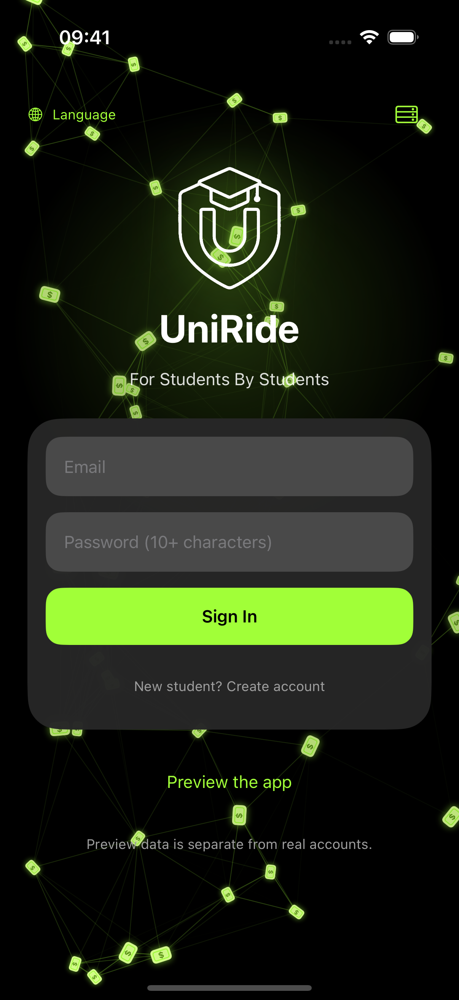
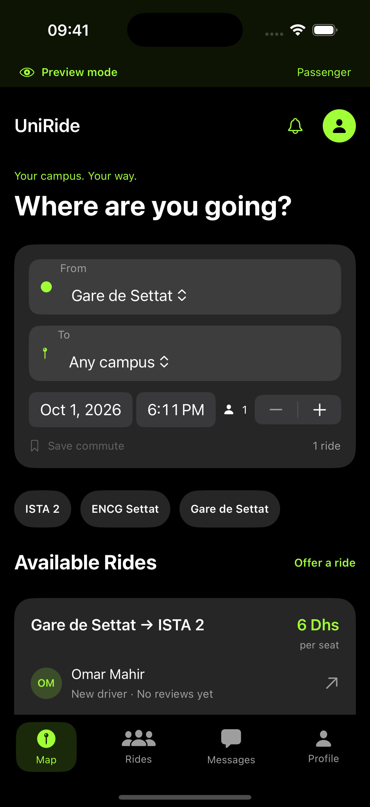
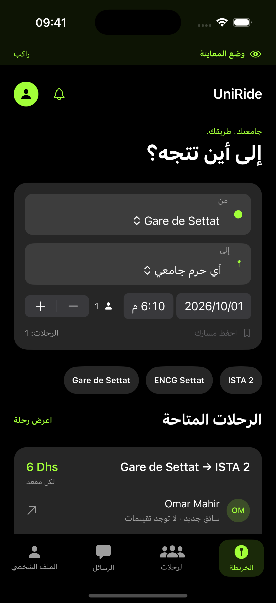

<div align="center">
  
  <h1>UniRide</h1>
  <p><strong>Your campus. Your way.</strong></p>
  <p>Campus ride sharing for students in Settat, Morocco.<br />Find a lift, share your commute, and stay connected from request to arrival.</p>
  <p><strong>iOS 16+</strong> &nbsp; · &nbsp; SwiftUI &nbsp; · &nbsp; MapKit &nbsp; · &nbsp; Python + SQLite</p>
  <p><a href="#screenshots">See the app</a> &nbsp; · &nbsp; <a href="#quick-start">Run locally</a> &nbsp; · &nbsp; <a href="backend/README.md">Backend guide</a></p>
</div>

## Screenshots

<table>
  <tr>
    <th align="center">Animated sign-in</th>
    <th align="center">Find your next ride</th>
    <th align="center">Arabic · العربية</th>
  </tr>
  <tr>
    <td align="center"></td>
    <td align="center"></td>
    <td align="center"></td>
  </tr>
</table>

Actual iPhone simulator captures. Ride listings shown here are labelled **Preview mode**; real accounts start with an empty database. The sign-in background animates in the app.

## Built for the campus commute

- **Find a ride:** search by departure, campus destination, time and seat count, with an interactive Apple map of Settat landmarks.
- **Make the daily trip easier:** save meeting places and named commutes; drivers can repeat departures on selected weekdays over two weeks.
- **Offer and book:** publish a ride with its Dhs price, car details and meeting note. Passengers request seats, and drivers accept or decline them.
- **Stay connected:** private booking conversations, trip sharing, an update inbox and local departure reminders.
- **Build trust through completed trips:** public driver profiles, real review counts and reviews from confirmed passengers after completion. Email and university verification require configured email delivery.
- **Feel at home:** English, French and Arabic, right-to-left layouts, the restored black/lime identity, haptics and Reduce Motion support.

### From request to arrival

1. **Driver publishes** a departure, meeting note, price and available seats.
2. **Passenger requests** seats for that trip.
3. **Driver confirms** the request. Only confirmed bookings consume seats.
4. **Both coordinate** through private chat and the car/meeting details.
5. **Driver completes** the trip; confirmed passengers can then leave a review.

Passenger cancellation releases confirmed seats. Drivers can update the departure, start the ride, complete it or cancel it; affected participants receive inbox updates.

## Quick start

### Requirements

- macOS with Xcode and an iPhone simulator or a connected iPhone.
- Python **3.11+** for the backend. No third-party Python packages are required.
- An Apple development signing team when running on a physical iPhone.

The app targets **iOS 16.0+**. The current project was built and checked with **Xcode 16.2**.

### 1. Clone and start the backend

```sh
git clone https://github.com/HMZ-E/UniRide.git
cd UniRide
python3 backend/server.py --host 0.0.0.0 --port 8787
```

The API stores its local database in `backend/data/`, which Git ignores. Keep this terminal running while using real accounts.

### 2. Open the iOS app

```sh
open UniRide.xcodeproj
```

Select the **UniRide** scheme, choose a simulator or your iPhone, and build/run. For an iPhone, select your development team under **Signing & Capabilities**.

| Where you run the app | Server address |
| --- | --- |
| iPhone simulator | `http://127.0.0.1:8787` |
| Physical iPhone on the Mac's Wi-Fi | `http://YOUR_MAC_LAN_IP:8787` |
| Hosted service / Release build | Your server's HTTPS URL |

Use the server button on sign-in or **Profile → Server settings** to change the address. For a physical iPhone, keep the Mac on and both devices on the same Wi-Fi; allow local network access when iOS asks. Debug builds allow local HTTP; Release builds require HTTPS.

### 3. Try both sides of a ride

Choose **Preview the app** for a persistent on-device demo. In **Profile**, switch between **Passenger** and **Driver** to explore both roles. Preview data is separate from real accounts and carries no fabricated verification badges or ratings.

For the connected flow, create two accounts: one driver and one passenger. Add the driver's car details, publish a ride, then request and accept a seat from the two accounts.

## Backend & privacy

The accompanying service uses Python's standard library and SQLite WAL. Seat decisions run inside database transactions, so simultaneous confirmations cannot oversell the last seat.

- Passwords are salted and hashed with PBKDF2-SHA256; raw passwords are never stored.
- Session tokens expire after 30 days. The server stores token hashes; the app stores its token in Keychain.
- Booking conversations and booking records are visible to their participants.
- Other users' email addresses are omitted from public profiles.
- Reviews require a confirmed passenger and a completed trip.
- SMTP and Apple push credentials stay on the backend; entering a university name alone does not award a badge.

See the [API, deployment and configuration guide](backend/README.md) and [environment template](backend/environment.example).

## Service setup

This repository provides a local campus pilot. The following services need external configuration before a hosted rollout:

| Service | Current behavior | What to configure |
| --- | --- | --- |
| Hosting | App connects to your local Mac | Persistent storage, an HTTPS host and the app's server URL |
| Email verification | Reports an explicit error if email delivery is unavailable | SMTP credentials and confirmed university email domains |
| Notifications | Inbox updates while open; local departure reminders after permission | For background updates: an APNs signing key, a push-enabled provisioning profile and the app's push setting |

Remote push registration is disabled in the current build. Set `UniRideRemotePushEnabled` after configuring push capabilities and provisioning. For a hosted Release build, set `UNIRIDE_API_URL` or enter the HTTPS endpoint on sign-in. Configuration details are in the [backend guide](backend/README.md).

Map pins suggest public landmarks; they are not surveyed pickup entrances or live driver locations. Use the driver's meeting note to confirm where to meet.

## Checks

```sh
# Backend behavior, authorization and concurrent seat decisions
python3 -m unittest discover -s backend/tests -v

# Simulator booking flow, translations and verification error handling
xcrun simctl list devices available
python3 Tests/run_ui_tests.py --simulator SIMULATOR_UUID
```

The UI runner creates its own temporary backend and database. It does not populate the real database.

**Latest local verification:** 19 backend tests and all 3 simulator UI tests passed. The full two-account flow covers publishing, requesting, chatting, driver acceptance, completion and review submission. A signed build was also installed on an iPhone 15 Pro.

## Project layout

```text
UniRide/
├── UniRide/                 SwiftUI app, MapKit view, localization and assets
├── UniRide.xcodeproj/       Xcode project
├── backend/                Python API, APNs worker and deployment configuration
│   └── tests/              Backend flow and privacy tests
├── Tests/                  Isolated iOS UI tests and runner
├── docs/images/            App screenshots used in this README
└── DESIGN.md               Original design references and restoration notes
```

## Design credits

The app icon, shield logo and animated sign-in were restored from the original UniRide assets and supplied design references. The campus screens extend the same black/lime identity. See the [design and restoration notes](DESIGN.md).
